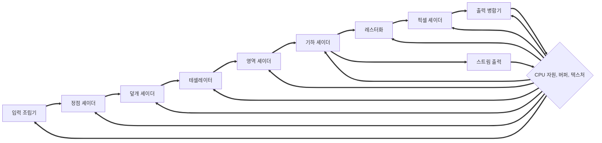

**목표**

1. 사람이 2차원 이미지에서 부피와 공간적 깊이감을 실제처럼 느끼게 만드는 핵심 단서를 알아본다.
2. 3차원 물체를 Direct3D에서 표현하는 방법을 파악한다
3. 가상 카메라를 정의하고 조작하는 방법을 배운다.
4. 렌더링 파이프라인, 즉 3차원 장면을 기하학적 서술로부터 2차원 이미지를 생성하는 단계를 이해한다.

## 3차원의 환상

3차원 세계의 깊이와 부피를 2차원 모니터에 어떻게 나타낼 수 있을까? 인간이 2차원 이미지를 3차원으로 "착각"하게 만드는 몇 가지 예시를 보자.

##### 소실점<sup>**vanishing point**</sup>

눈 앞에 일직선으로 무한히 길게 뻗어있는 철로가 있다고 하자. 철로의 두 레일은 평행하지만, 우리 눈에는 마치 레일이 점점 가까워지다가 결국은 아주 먼 지점에서 하나로 합쳐지는 것 처럼 보인다. 이는 시각의 평행선이 무한히 멀리 있는 하나의 소실점으로 수렴한다는 인간 시각의 특징이다.

##### 원근감

같은 물체라도 멀리 있으면 더 작게 보인다.

##### 물체 겹침

불투명한 물체가 앞뒤로 있을 경우, 뒤의 물체의 일부 또는 전체는 앞의 물체에게 가려진다.

##### 조명

3차원 구에 조명이 없다면 2차원 이미지는 원과 다를 바가 없다. 하지만 조명이 있다면 사람은 이것을 3차원 구로 인지한다.

##### 그림자

그림자는 광원의 물체에 대한 상대적인 위치(3차원)를 짐작하게 한다. 또한 그림자가 드리운 지면과 물체의 거리를 짐작하게 한다.

## 모형의 표현

Direct3D 응용 프로그램은 고형<sup>**solid**</sup>의 3차원 물체를 삼각형 메시<sup>**mesh**</sup>로 근사하여 표현한다. 삼각형을 많이 사용할수록 물체를 잘 근사할 수 있지만 메시를 처리하는 데 필요한 처리량도 늘어난다.

## 컴퓨터 색상의 기본 개념

3차원 벡터 $(r,g,b)$로 표현한다. 각각은 0에서 1까지 정규화된 값을 사용하는데, 0은 빛이 전혀 없는 것이고 1은 빛의 세기가 최대인 것이다.

$(0.25,0.67,1.0)$은 25% 세기의 적색광과 67% 세기의 녹색광, 100% 세기의 청색광이 혼합된 색을 뜻한다.

일부 벡터 연산은 색상 벡터에도 적용된다. 두 벡터의 합과 차는 조명의 합과 차와 일치한다. 스칼라 곱셈도 조명이 몇 배로 세졌는지를 나타낸다.

내적과 외적은 색상 벡터에 별로 의미가 없다. 그러나 색상 벡터만의 연산도 있는데, 변조<sup>**modulation**</sup>이라 하는 성분별 곱셈<sup>**componentwise multiplication**</sup>이다.

$$(c_r,c_g,c_b) \otimes (k_r,k_g,k_b) = (c_r k_r, c_g k_g, c_b k_b)$$

이 연산은 주로 조명 공식에 쓰인다. $(r,g,b)$ 광선이 적색광을 50%, 녹색광을 75%, 청색광을 25% 반사하고 나머지는 흡수하는 표면에 입사했다면, 반사된 광선의 색은 다음과 같다.

$$(0.5,0.75,0.25) \otimes (r,g,b) = (0.5 r, 0.75 g, 0.25 b)$$

지금까지 언급된 연산을 색상 벡터에 적용하다 보면 성분들의 값이 $[0,1]$ 구간 밖으로 나갈 수 있다. 이런 경우 구간 안의 값으로 보정해야 한다. 즉, 0보다 작은 값은 0으로 1보다 큰 값은 1로 만들어야 한다.

##### 128비트 색상

그래픽 프로그램에서 색을 다룰때 흔히 RGB값 외에 알파<sup>**alpha**</sup>라고 부르는 성분 하나를 추가로 다훈다. 이는 색의 불투명도를 나타내는 값이다.

따라서 필요한 성분은 RGBA 4개고, 하나당 32비트 부동소수점 값 하나로 표현하면 색상당 128비트가 필요하다.

##### 32비트 색상

성분당 8비트를 할당하여 색상을 32비틇 표현할 수 있다. 성분당 $[0,255]$의 정수 값을 할당하면 된다.

## 렌더링 파이프라인 개요

렌더링 파이프라인<sup>**rendering pipeline**</sup>은 카메라에 비친 3차원 장면의 모습에 근거해서 2차원 이미지를 생성하는 데 필요한 일련의 단계를 말한다.

CPU 자원, 버퍼, 텍스처를 모든 단계에서 같이 사용함을 주목하자. 서로 다른 단계에서 똑같은 메모리 주소에 있는 데이터를 읽고, 다른 용도로 사용할 수도 있다.



## 입력 조립기<sup>**input assembler**</sup> 단계

메모리에서 기하 자료(정점과 색인 등)를 읽어서 기하학적 기본 도형을 조립한다.

##### 정점 버퍼<sup>**vertex buffer**</sup>

정점은 정점 버퍼라고 하는 특별한 Direct3D 자료구조 안에 담겨서 렌더링 파이프라인에 묶인다. 연속된 메모리에 단순히 저장할 뿐, 이 정점을 어떻게 결합하여 도형을 만드는지 정보는 들어있지 않다. 정점을 어떻게 사용해서 기하학적 기본도형을 만드는지 Direct3D에 기본도형 위상구조<sup>**primitive topology**</sup>를 설정해서 알려줘야 한다.

##### 색인

여러 삼각형을 이용하여 n각형을 만드는 것을 상상해보자. 필연적으로 일부 정점은 여러 번 사용된다. 중복된 점을 여러 번 정점 버퍼에 넘겨준다면

1. 메모리 요구량이 증가한다.
2. 그래픽 하드웨어의 처리량이 증가한다.

이에 대한 해결책은 색인<sup>**index**</sup>의 사용이다. 정점 목록에는 고유한 정점들을 한 번만 집어넣고, 정점 목록의 어떤 정점을 사용하는지 색인 목록을 만들어 사용한다면 같은 정점을 여러 번 처리할 일이 없어진다.

색인 목록에는 중복된 색인이 여러 번 들어가지만, 색인은 그냥 정수이므로 메모리를 훨씬 적게 차지한다.

## 정점 셰이더<sup>**vertex shader**</sup> 단계

정점 셰이더는 정점 하나를 받아서 정점 하나를 출력하는 함수라고 생각하면 된다. 하드웨어 안에서 다음과 같은 일이 알어난다고 생각하자.

```cpp
for (vertex v : inputVertex) {
    outputVertex.push_back(VertexShader(v));
}
```

정점 셰이더 함수의 구체적인 내용은 프로그래머가 구현해서 GPU에 제출한다. 변환, 조명, 변위 매핑 등 많은 특수 효과를 정점 셰이더에서 수행할 수 있다.

##### 국소 공간<sup>**local space**</sup>과 세계 공간<sup>**world space**</sup>

모빌을 만들어서 천장에 매달고 싶다. 모빌을 어디서 만들어야 할까? 천장에 줄을 매달고 그 줄에서 직접 모빌을 만드는 것은 멍청한 행동이다. 다른 공간에서 모빌을 만든 뒤, 집에 가져와 천장에 매다는 것이 현명하다.

3차원 모형도 그런 식으로 작업한다. 물체의 기하구조를 장면 전역의 좌표계를 기준으로 직접 구축하는 것이 아니라 물체 자신의 국소 좌표계를 기준으로 구축한다. 국소 공간에서 작업하면 좌표계 원점을 물체의 중심 가까이에 둘 수 있고 좌표축들을 물체에 맞게 정렬할 수 있어서 편하다.

하지만 만든 물체를 세계 공간에 적절한 위치와 방향으로 배치해야 한다. 이 작업을 세계 변환<sup>**world transform**</sup>이라 하고, 이 변환에 필요한 행렬을 세계 행렬<sup>**world matrix**</sup>라고 한다.

물체의 국소 공간을 세계 공간에 상대적인 좌표로 서술하고 그 좌표를 행으로하는 행렬을 만들면 세계 행렬을 만들 수 있다. $Q_w = (Q_x,Q_y,Q_z,1), \\ u_w = (u_x,u_y,u_z,0), \\ v_w = (v_x,v_y,v_z,0), \\ w_w = (w_x,w_y,w_z,0)$이 각각 국소 공간의 원점과 $x,y,z$축들을 세계 공간에 상대적인 동차좌표로 나타낸 것이라고 할때, 세계 행렬은 아래와 같다.

$$
\begin{bmatrix}
u_x & u_y & u_z & 0 \\
v_x & v_y & v_z & 0 \\
w_x & w_y & w_z & 0 \\
Q_x & Q_y & Q_z & 1 \\
\end{bmatrix}
$$

##### 시야 공간<sup>**view space**</sup>

##### 투영<sup>**projection**</sup>과 동차 절단 공간<sup>**homogeneous clip space**</sup>

(보류)

## 테셀레이션<sup>**tessellation**</sup> 단계

주어진 메시의 삼각형을 더 잘게 쪼개서 새로운 삼각형을 만드는 과정이다. 처음부터 잘개 쪼갠 메시를 전달하지 않고 굳이 여기서 쪼개는 이유는...

1. 카메라에 가까운 삼각형에만 테셀레이션을 적용할 수 있다. 관찰자가 볼 수 없는(보더라도 테셀레이션의 적용 유무를 구분할 수 없는) 부분에 드는 연산을 줄일 수 있다.
2. 메모리에는 저다각형 메시만 담고, 즉석에서 추가함으로써 메모리를 절약할 수 있다.
3. 에니메이션이나 물리 처리같은 연산은 단순한 저다각형 메시에 대해 수행하고, 테셀레이션된 고다각형 메시는 렌더링에만 사용함으로써 연산을 줄일 수 있다.

## 기하 셰이더<sup>**geometry shader**</sup> 단계

12장에서 자세히 설명한다.

## 레스터화<sup>**rasterization**</sup> 단계

투영된 3차원 삼각형으로부터 픽셀 색상을 계산한다.

##### 뷰포트 변환

절단을 마치면 하드웨어는 원근 나누기를 수행해서 동차 절단 공간 좌표를 정규화된 장치 좌표<sup>NDC</sup> 로 변환할 수 있다. 정점들이 NDC 공간으로 들어오면 2차원 이미지를 형성하는 점들의 2차원 $x,y$ 좌표성분들이 후면 버퍼의 한 직사각형 영역으로 변환된다. 그 직사각형 영역이 뷰포트이다.

##### 후면 선별<sup>**backface culling**</sup>

삼각형에는 면이 두 개 있다. 두 면을 Direct3D에는 다음과 같은 방법으로 구분한다. 삼각형 정점들이 $v_0,v_1,v_2$의 순서로 감긴다고 할 때, 삼각형의 법선 $n$은 다음과 같이 정의된다.

$$
\begin{align}
e_0 & = v_1 - v_0 \\
e_1 & = v_2 - v_1 \\
n   & = \frac{e_0 \times e_1}{e_0 \times e_1}
\end{align}
$$

즉, 정점이 감기는 순서가 시계방향이면 전면, 반시계방향이면 후면 삼각형이다. 3차원 장면에서 대부분의 물체는 닫힌 다면체 도형이다. 그러면 카메라에는 다면체의 후면 삼각형이 보이지 않는다. 따라서 후면 삼각형은 그릴 필요가 전혀 없고, 파이프라인에서 후면 삼각형은 전부 폐기해도 된다. 이 공정을 후면 선별이라고 한다. 후면 선별에 의해 처리해야 할 삼각형의 수가 거의 절반으로 줄어들 수 있다.

## 픽셀 셰이더<sup>**pixel shader**</sup> 단계

프로그래머가 작성하고 GPU가 실행하는 프로그램이다.  픽셀 셰이더는 각각의 픽셀 단편<sup>**pixel fragment**</sup>에 대해 실행된다. 보간된 정점 특성을 입력받아서 하나의 색상을 출력한다. 여기서 최종적인 픽셀들의 색이 결정된다.

## 출력 병합기<sup>**output merger**</sup> 단계

이 단계에서 일부 픽셀 단편들이 기각될 수 있다(이를테면 깊이 판정이나 스텐실 판정에 의해). 기각되지 않은 픽셀 단편들은 후면 버퍼에 기록된다. 혼합도 이 과정에서 일어난다. 혼합은 새 픽셀이 후면 버퍼의 기존 픽셀을 완전히 덮는 것이 아니라 두 픽셀을 어떤 공식에 따라 섞어서 기록하는 것을 말한다. 보통 반투명같은 특수 효과를 낼 때 쓰인다.